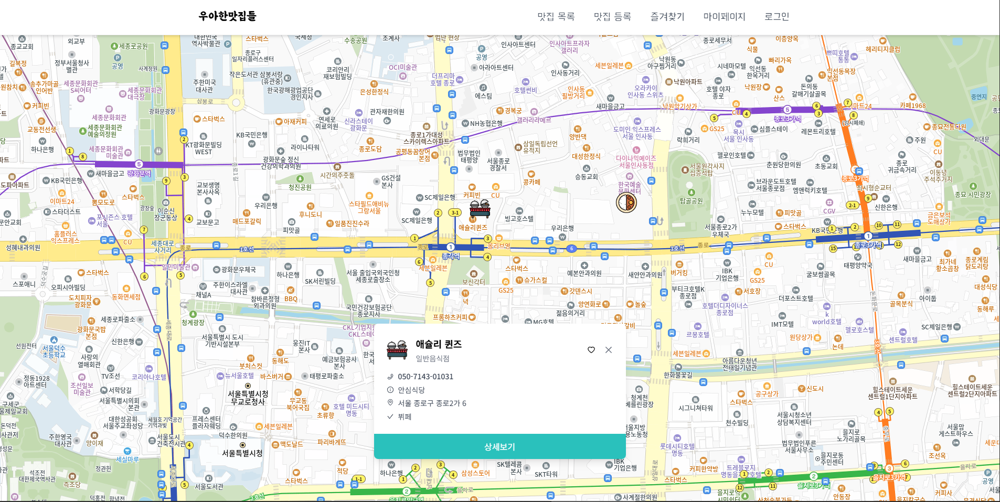
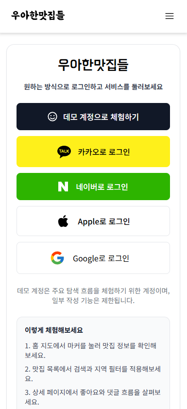
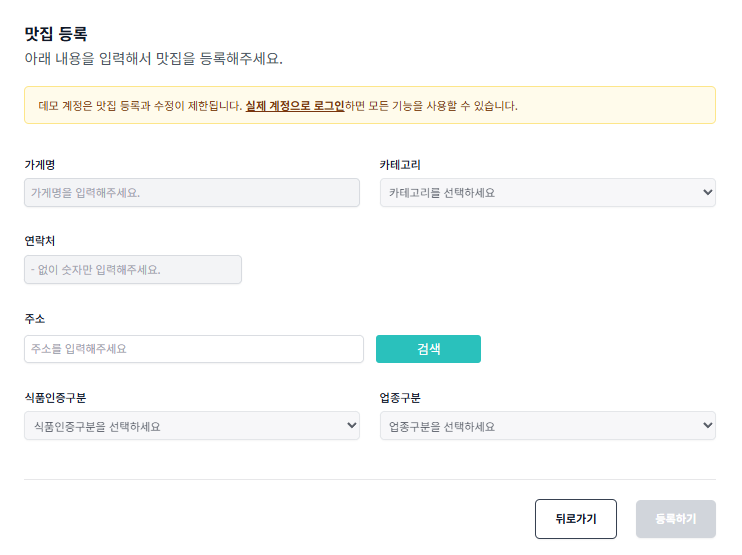

# 우아한맛집들

위치 기반으로 맛집을 탐색하고, 사용자가 직접 맛집을 등록하고, 좋아요와 댓글로 기록을 남길 수 있는 풀스택 웹 서비스입니다.

- 배포 주소: `https://next-eats-app.vercel.app`
- 정식 릴리즈: [`v1.0.0`](https://github.com/ITb4ng/next-eats-app/releases/tag/v1.0.0)
- 저장소: `https://github.com/ITb4ng/next-eats-app`

## 프로젝트 소개

기존 맛집 서비스는 검색 결과가 리스트 중심으로 보이거나, 지도를 보더라도 사용자가 직접 데이터를 쌓아가는 흐름이 약한 경우가 많았습니다.

우아한맛집들은 아래 경험을 하나의 흐름으로 연결하는 데 집중했습니다.

- 지도에서 빠르게 탐색하기
- 관심 있는 맛집을 저장하기
- 맛집 상세 정보와 댓글 흐름 확인하기
- 사용자가 직접 맛집을 등록하기

## 주요 기능

### 1. 지도 기반 맛집 탐색
- Kakao Map 위에 맛집 마커를 표시합니다.
- 마커 클릭 시 오버레이와 상세 정보를 확인할 수 있습니다.
- 현재 위치 기반으로 지도를 이동할 수 있습니다.

### 2. 검색 / 지역 필터 / 무한 스크롤
- 키워드 검색과 지역 필터를 함께 적용할 수 있습니다.
- `React Query`와 `Intersection Observer`를 활용해 무한 스크롤을 구현했습니다.
- URL 쿼리와 전역 상태를 연결해 뒤로가기와 새로고침 이후에도 검색 조건을 복원합니다.

### 3. 로그인과 개인화
- `NextAuth` 기반으로 Kakao, Google, Naver 로그인 기능을 제공합니다.
- 로그인한 사용자 기준으로 좋아요, 댓글, 마이페이지 기능이 동작합니다.
- 데모 계정을 통해 주요 탐색 흐름을 바로 체험할 수 있습니다.

### 4. 맛집 등록
- `React Hook Form` 기반 폼 검증을 적용했습니다.
- 도로명 주소를 기반으로 Kakao Local API에서 좌표를 변환해 저장합니다.
- 등록한 데이터는 지도와 목록에 자연스럽게 반영됩니다.

### 5. 좋아요 / 댓글 / 마이페이지
- 사용자별 좋아요 토글과 좋아요 목록 조회를 지원합니다.
- 맛집 상세 페이지에서 댓글 작성과 삭제가 가능합니다.
- 마이페이지에서 작성한 댓글을 관리할 수 있습니다.

## 데모 계정

`v1.0.0` 기준으로 데모 계정 체험 흐름이 추가되었습니다.

- 로그인 페이지에서 `데모 계정으로 체험하기` 버튼으로 바로 로그인할 수 있습니다.
- 데모 계정은 탐색, 목록 조회, 상세 확인, 좋아요 흐름을 체험하는 용도입니다.
- 데모 계정은 맛집 등록, 수정, 삭제, 댓글 작성 같은 쓰기 기능이 제한됩니다.

## v1.0.0 릴리즈 요약

첫 정식 릴리즈에서 아래 내용을 기준선으로 정리했습니다.

- 지도 기반 맛집 탐색 핵심 흐름 구현
- 검색 / 지역 필터 / 무한 스크롤 목록 조회 연결
- OAuth 로그인과 개인화 기능 구성
- 맛집 등록 / 좋아요 / 댓글 / 마이페이지 흐름 연결
- 데모 계정 로그인 및 권한 분기 추가
- 모바일 네비게이션과 현재 화면 활성 상태 UI 개선
- Prisma 7 및 `pg adapter` 기반 환경 정리
- 빌드 및 프리뷰 배포 안정화

## 스크린샷

아래 경로는 `v1.0.0` 릴리즈 문서와 README에서 함께 사용할 수 있도록 미리 맞춰 둔 자리입니다.
이미지는 이후 경로에 맞게 추가하면 됩니다.

### 홈 지도


### 로그인 / 데모 계정


### 맛집 등록


## 기술 스택

### Frontend


### State / Data


### Auth / Form


### Database / Infra


### External API


## 트러블슈팅 / 개선 경험

### Recoil에서 Zustand로 전환
- Next 15 / React 19 환경에서 Recoil 유지 비용과 호환성 부담을 줄이기 위해 Zustand로 상태 관리를 전환했습니다.
- 검색 상태와 지도 상태를 분리해 구조를 단순화했습니다.

### 무한 스크롤 안정화
- 스크롤 끝 감지 시 중복 호출이 발생하지 않도록 `Intersection Observer`와 `fetchNextPage` 호출 타이밍을 조정했습니다.
- 검색 조건이 바뀔 때도 자연스럽게 새 목록을 가져오도록 쿼리 키를 구성했습니다.

### Hook 순서 오류와 로딩 상태 정리
- `Rendered more hooks than during the previous render` 문제를 수정하며 조건부 렌더링 구조를 점검했습니다.
- `status === "loading"` 처리와 로더 분기를 보완해 초기 렌더 오류 가능성을 줄였습니다.

### 모바일 UI / 접근성 개선
- 모바일 메뉴 동작, 포커스 스타일, 버튼 상호작용을 개선했습니다.
- 현재 보고 있는 화면이 네비게이션에서 바로 드러나도록 활성 상태 UI를 추가했습니다.

## 주요 폴더 구조

```bash
docs
└─ screenshots     # README / 릴리즈 문서에 사용하는 화면 캡처

public
├─ fonts           # 커스텀 폰트
└─ images          # 마커 등 정적 이미지 자산

prisma
└─ migrations      # DB 마이그레이션 이력

src
├─ components      # 지도, 마커, 댓글, 검색 필터, 네비게이션 등 공통 UI
├─ data            # 카테고리 / 지역 등 정적 데이터
├─ db              # Prisma Client 연결
├─ generated       # Prisma generated client
├─ hooks           # Intersection Observer 커스텀 훅
├─ interface       # 공통 타입 정의
├─ pages           # 페이지 및 API Routes
├─ styles          # 전역 스타일
├─ types           # 외부 라이브러리 타입 선언
└─ zustand         # 검색 / 지도 / 선택 상태 관리

prisma/schema.prisma # User, Store, Like, Comment 모델
```

## 실행 방법

### 1. 설치

```bash
npm install
```

### 2. 환경 변수 설정

`.env.local`에 아래 값을 설정합니다.

```bash
DATABASE_URL=
NEXTAUTH_URL=
NEXTAUTH_SECRET=

KAKAO_CLIENT_ID=
KAKAO_CLIENT_SECRET=

GOOGLE_CLIENT_ID=
GOOGLE_CLIENT_SECRET=

NAVER_CLIENT_ID=
NAVER_CLIENT_SECRET=

NEXT_PUBLIC_API_URL=http://localhost:3000
NEXT_PUBLIC_KAKAO_MAP_CLIENT=
```

### 3. Prisma 반영

```bash
npx prisma migrate deploy
npx prisma generate
```

개발 환경에서 빠르게 스키마를 맞출 때는 아래 방식도 사용할 수 있습니다.

```bash
npx prisma db push
```

### 4. 개발 서버 실행

```bash
npm run dev
```

캐시가 꼬였을 때는 아래 스크립트로 `.next`를 정리할 수 있습니다.

```bash
npm run clean
npm run dev
```

## 브랜치 운영

- `main`: 배포와 릴리즈 기준 브랜치
- `dev`: 기본 개발 브랜치

## 앞으로의 개선 방향

- 지도 클릭 기반 맛집 등록 흐름 강화
- 주소 입력 부담을 줄이는 위치 선택 UX 개선
- 공개 페이지 SEO 보완
- 운영 관점의 데이터 검증 및 관리 기능 확장
- 테스트와 배포 체크리스트 보강

## 회고

이 프로젝트는 단순 화면 구현보다 실제 사용자 흐름을 갖춘 서비스를 끝까지 연결해 본 경험에 가깝습니다.

- 사용자 경험을 고려해 기능을 설계하고 UI를 개선하는 능력
- 프론트엔드와 백엔드 경계를 넘나들며 문제를 해결하는 능력
- 기술 선택 이유와 리팩터링 배경을 설명할 수 있는 개발 태도

를 함께 보여줄 수 있는 프로젝트로 정리하고 있습니다.
